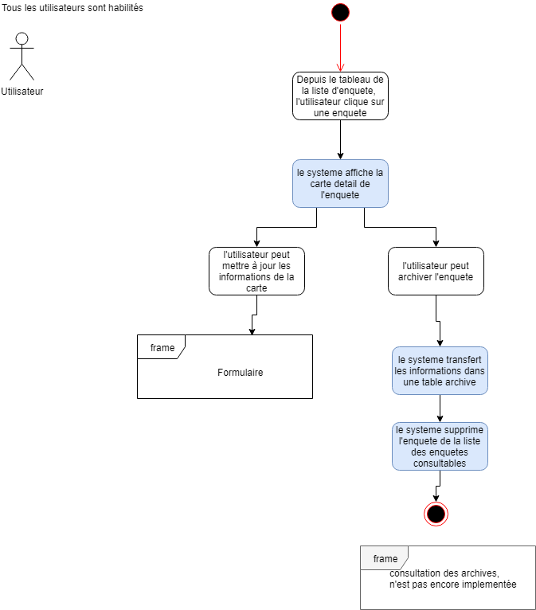
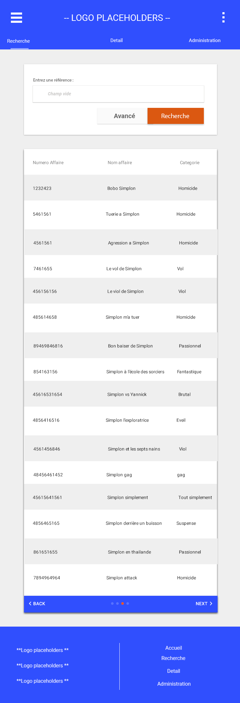

# Projet Csi miami
### Toutes les images présentes ainsi que d'autres support qui ont permit le developpement du projet sont disponibles dans le dossier Document du projet

A l'attention du client
## MODE OPÉRATOIRE

### Prérequis (Back)
- Java 1,8
- Maven (+ commandes exécuter/déployer)
- Git
- SGBDR MySQL
- filRougeSchemaDB.mwb ( genere le schema workbench de la base de données)
- scriptDatabase.sql
- requetesInsertionDonnées.sql (obtention des données)

#### Modifications nécessaires (Java : /CSI-Back/src/main/resources/application.properties)
- spring.datasource.url=jdbc:mysql :
- spring.datasource.username
- spring.datasource.password

- Si besoin de changer le port du serveur Tomcat,  ajouter la ligne : 
server.port: XXXX

### Prérequis (Front)
- NodeJS

### Lancement

#### Back
Dans un repertoire de votre choix ouvrir `GitBash` et entrer la commande `git clone https://github.com/jipaow/CSI-Back.git`.

# GENERATION DU FICHIER Csiback-0.0.1-SNAPSHOT.jar
 pour génerer le fichier .jar executable :
 - se placer dans le repertoire du projet (CSI-Back/CSI-Back) 
 - ouvrir un invité de commande à cet emplacement
 - taper la commande `mvn package` ( si le serveur du projet est lancé) ou `mvn pacakge -DskipTests` (si le serveur du projet n'est pas lancé le build ne se fera pas)
 -le fichier Csiback-0.0.1-SNAPSHOT.jar est génerer dans le dossier target

# LANCEMENT DU SERVEUR
1. Ouvrir une invite de commande dans le dossier contenant le fichier jar ( le dossier target )
2. Entrer : ```java -jar Csiback-0.0.1-SNAPSHOT.jar```

#### Front
1. Cloner le repository
2. cd 
3. ```npm install```
4. ```npm install -g @angular/cli```
5. ```ng serve -o```
6. ```ng build``` (créer le dist/ avec l’index html)

## DIAGRAMMES

### USECASE

- USECASE DE L’APPLICATION


-DIAGRAMME DE PACKAGE DE FONCTIONNALITES


### DIAGRAMMES D’ACTIVITE

- CREATION DE SUSPECT


- CREATION D'UNE AFFAIRE


- AJOUT D'UN SUSPECT DANS UNE AFFAIRE


- CONSULTATION DE LA FICHE D'UNE ENQUETE




### DIAGRAMME DE CLASSES


### MOCKUPS

- PAGE DE CONNEXION


- PAGE DE L’ADMINISTRATEUR


- PAGES DES ENQUETES


- CONSULTATION DES AFFAIRES



- FICHE SUSPECT


### BASE DE DONNEE
La modelisation et la conception de la base de donnée ont été realisé avec  le SGBDR (Système de Gestion de Bases de Données Relationnelles) MySql.
`SGBDR` : En informatique, un système de gestion de base de données (abr. SGBD) est un logiciel système destiné à stocker et à partager des informations dans une base de données, en garantissant la qualité, la pérennité et la confidentialité des informations, tout en cachant la complexité des opérations.

### SCHEMA SQL
Document/schemaDB.png


### SCRIPTS SQL
- Document/`filRougeSchemaDB3.mwb`
- Rappel : Pour génerer un jeux de données, le fichier `requetesInsertionDonnées.sql` est nécessaire et bien présent dans le projet (/Fil_Rouge/src/main/resources/data.sql) :
-> Génération d'enquetes.
-> Génération d'agents , de suspects .
-> Génération des codes des statuts ( agent , temoin , suspect ..)
-> Génération d'archive d'enquêtes.


____________________________________________________________________________________________________________________________________________
@Author jean-philippe:

### BACKEND
- Package co.simplon.model : Suspect.java  / DataSuspect.java classes ("surclasse" qui permet le typage du modele pour son traitement
par le frontEnd).
- Package co.simplon.dao : SuspectDAO.java Interface definissant les méthodes de traitement de la couche dao pour communiquer avec 
la base de donnée.
                           jdbcSuspectDAO.java Classe qui implémente les methodes de SuspectDAO.java utilise le preparedStatement pour executer les requtes sql (les instances de PreparedStatement contiennent des instructions sql déjà compilées qui améliore notement les preformances, les instructions sql contiennent un ou plusieurs paramètres d'entée) afin de communiquer avec le base de donnée.
- Package co.simplon.service : SuspectService.java Classe qui expose au Controller les méthodes permettant de faire le lien entre 
la couche DAO et le ce dernier.
- Package co.simplon.controller: SuspectController.java permet le mapping des requetes url, classe permettant l'interaction entre le client et le server en traitant les actions de l'utilisateur, modifie les données du modèle et de la vue.
- Package co.simplon.tests ( dans le dossier src/test/java ):  SuspectControllerTest.java teste les methodes getAllSuspect()
et get SuspectbyId() service/controller.
                                 TestDAO.java test les methodes Insert et Update.
ces classes de tests ont été realisé ("pair programming") en collaboration avec Robin.
- Le projet BackEnd contient des packages et classes realisées en commun tel que Security qui met en place la solution d'authentification fournie par Sebastien, ainsi que StorageService, UploadController qui devaient permettre la gestion d'upload et de download de fichier mais qui devront être implemntées dans une V2, Enfin les classes concernant les armes.

### FRONTEND

- Repository CSI-Front est le repository front commun le tableau, formulaires ( creation et update ) et la carte de détail sont basée sur les composants realisés sur une maquette front => https://github.com/jipaow/suspectFront. Ces composants ont été largement remaniés et optimisés par Kayetan.
- Repository suspectFront : Composant (Component) suspect ( tableau de liste des suspects ) / update-suspect ( formulaire d'update des informations d'un suspect) / form-suspect ( formulaire de creation d'un suspect ) / edit-suspect ( carte contenant le détails des infos d'un suspect ainsi que le lien vers le formulaire d'update (d'où le nom de composant pas très judicieux de prime abord) ) / suspect.service.ts classes de service qui permet l'interaction avec la partie server Backend .
les tel qu'app-routing, app-module, suspect.ts .

                                 


